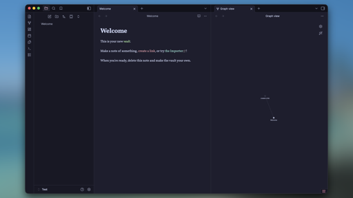

# Wololoo — an Obsidian theme



A warm, focused theme for [Obsidian](https://obsidian.md). Wololoo is a remix of
[Catppuccin for Obsidian](https://github.com/catppuccin/obsidian): same palette
power and Style Settings options, tuned for everyday writing and note-taking.

## Features

- Light and dark modes (Latte / Frappé / Macchiato / Mocha)
- Full Catppuccin accent palette via the [Style Settings](https://github.com/mgmeyers/obsidian-style-settings) plugin
- Custom callouts, tag pills, checklist states and PDF styles
- Designed around the [Vollkorn](http://vollkorn-typeface.com) typeface (optional)

## Install

### From the Community Themes browser *(coming soon)*

`Settings → Appearance → Manage → Browse`, search for **Wololoo**, install and apply.

### With BRAT (for beta versions)

1. Install the [BRAT](https://github.com/TfTHacker/obsidian42-brat) plugin.
2. `BRAT → Add beta theme` and paste `raulanatol/wololoo-obsidian-theme`.
3. Enable Wololoo in `Settings → Appearance`.

### Manual install

```shell
cd /path/to/your/vault/.obsidian/themes
git clone https://github.com/raulanatol/wololoo-obsidian-theme.git Wololoo
```

Then enable **Wololoo** under `Settings → Appearance → Themes`.

## Recommended setup

- **Style Settings** plugin — exposes the flavor selector, accent and font-color
  options shipped with the theme (the panel is labeled "Catppuccin:" because
  the IDs are kept compatible with upstream).
- **Vollkorn font** — install it system-wide or drop the files in
  `.obsidian/fonts/`. Without it the theme falls back to your text font.
- **Optional snippet** — `snippets/wololoo.css` hides the vault root folder
  name in the file explorer. Copy it to `.obsidian/snippets/` and enable it
  under `Settings → Appearance → CSS snippets`.

## Credits

Wololoo is built on top of the work of:

- [Catppuccin for Obsidian](https://github.com/catppuccin/obsidian) by Marshall Beckrich and the Catppuccin org.
- The [Catppuccin](https://github.com/catppuccin/catppuccin) color palette.

## License

MIT — see [LICENSE](LICENSE).
